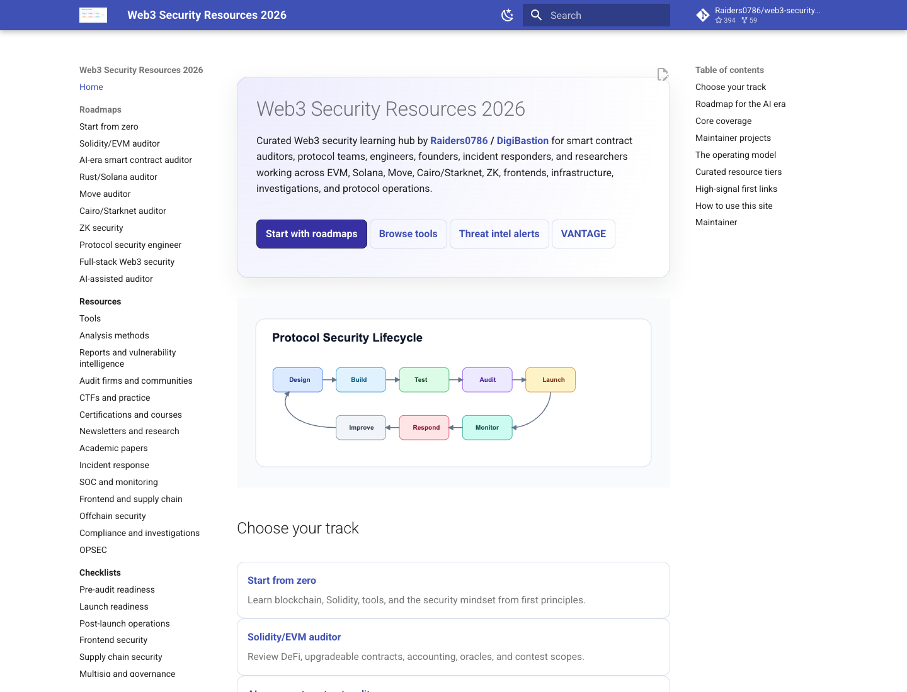

# Web3 Security Resources 2026

Curated Web3 security learning hub by **Raiders0786 / DigiBastion** for smart
contract auditors and protocol teams: roadmaps, audit tools, public reports,
fuzzing, formal verification, AI-assisted workflows, offchain security,
incident response, compliance, and launch checklists.

This repository is no longer a giant bookmark dump. It is a GitHub Pages
knowledge base for people who want to learn, audit, build, launch, investigate,
and operate Web3 systems safely.

<p>
  <strong>Best experience:</strong>
  Browse the full mapped site with roadmaps, resource pages, diagrams, and
  maintained links:
  <a href="https://raiders0786.github.io/web3-security-resources/">
    raiders0786.github.io/web3-security-resources
  </a>
</p>

<p>
  <a href="https://raiders0786.github.io/web3-security-resources/">
    
  </a>
</p>

## Start Here

| Goal | Best entry point |
| --- | --- |
| I am new to Web3 security | [Start From Zero](docs/roadmaps/start-from-zero.md) |
| I want to become an EVM auditor | [Solidity/EVM Auditor](docs/roadmaps/solidity-evm-auditor.md) |
| I want to become a smart contract auditor who stays relevant with AI | [AI-era Smart Contract Auditor](docs/roadmaps/ai-era-smart-contract-auditor.md) |
| I audit Solana programs | [Rust/Solana Auditor](docs/roadmaps/solana-rust-auditor.md) |
| I work on Move, Cairo, or ZK systems | [Move](docs/roadmaps/move-auditor.md), [Cairo/Starknet](docs/roadmaps/cairo-starknet-auditor.md), [ZK Security](docs/roadmaps/zk-security.md) |
| I run security for a protocol | [Protocol Security Engineer](docs/roadmaps/protocol-security-engineer.md) |
| I secure a Web3 frontend or app stack | [Full-Stack Web3 Security](docs/roadmaps/full-stack-web3-security.md) |
| I want AI-assisted audit workflows | [AI-Assisted Auditor](docs/roadmaps/ai-assisted-auditor.md) |
| I want tools by analysis method | [Analysis Methods](docs/resources/analysis-methods.md) |
| I want offchain or compliance coverage | [Offchain Security](docs/resources/offchain-security.md), [Compliance & Investigations](docs/resources/compliance-and-investigations.md) |

## What This Hub Covers

- Smart contract auditing across Solidity/EVM, Solana/Rust, Move, Cairo/Starknet, and ZK.
- Static analysis, fuzzing, invariant testing, symbolic execution, formal verification, and dynamic analysis.
- AI-assisted auditing with benchmark caveats and verification-first workflows.
- Public reports, vulnerability intelligence, CTFs, exploit reproduction, and research.
- Frontend, DNS, wallet UX, API, cloud, CI/CD, dependency, and supply-chain security.
- Monitoring, incident response, investigations, compliance, sanctions/AML tooling, and launch readiness.

## High-Signal Resources

- [OWASP Smart Contract Top 10 2026](https://owasp.org/www-project-smart-contract-top-10/)
- [OWASP Smart Contract Security Verification Standard](https://scs.owasp.org/SCSVS/)
- [OpenZeppelin Readiness Guide](https://www.openzeppelin.com/readiness-guide)
- [SEAL Frameworks](https://frameworks.securityalliance.org/)
- [Solodit](https://solodit.cyfrin.io/)
- [DeFiHackLabs](https://github.com/SunWeb3Sec/DeFiHackLabs)
- [Pashov AI Web3 Security](https://github.com/pashov/ai-web3-security)
- [TestMachine EVMbench](https://testmachine.ai/evmbench/)
- [DigiBastion Threat Intel](https://www.digibastion.com/threat-intel)
- [VANTAGE by DigiBastion](https://vantage.digibastion.com/)

## Resource Tiers

- **Must learn**: Foundational resources worth studying deeply.
- **Use in real audits**: Tools and references that repeatedly help on live work.
- **Situational / advanced**: Specialized material for specific systems or risks.
- **Paid / certification**: Useful but not required; cost or access may limit use.
- **Watchlist**: Promising, niche, or changing quickly; verify before relying on it.

## Disclaimer

This is an educational resource hub. Links, listings, categories, tiers,
summaries, and mentions are not endorsements by Raiders0786, DigiBastion,
maintainers, contributors, or this project.

Third-party resources can change without notice. Verify tools, firms, projects,
courses, reports, datasets, dependencies, and services before relying on them,
especially before running anything against sensitive code or infrastructure.
Nothing here is legal, financial, investment, compliance, or professional
security advice. See the full [site disclaimer](docs/disclaimer.md).

## Maintainer

Maintained by **Raiders0786 / DigiBastion**.

- X: [@__Raiders](https://x.com/__Raiders)
- Telegram: [t.me/raiders0786](https://t.me/raiders0786)
- DigiBastion: [digibastion.com](https://digibastion.com/)
- DigiBastion Threat Intel: [daily, weekly, or immediate alerts](https://www.digibastion.com/threat-intel?tab=subscribe)
- VANTAGE: [vantage.digibastion.com](https://vantage.digibastion.com/)

## Local Development

```bash
pip install -r requirements.txt
mkdocs serve
mkdocs build --strict
```

The deployed site is configured for:

```text
https://raiders0786.github.io/web3-security-resources/
```

Deployment uses GitHub Actions. If Pages deployment reports that the Pages site
does not exist, configure the repository under `Settings -> Pages -> Build and
deployment -> Source -> GitHub Actions`; the workflow also asks GitHub to enable
Pages automatically.

## Contributing

Please read [CONTRIBUTING.md](CONTRIBUTING.md). New resources must include a
title, URL, category, why it matters, free/paid status, and last verified date.
This project favors high-signal curation over exhaustive indexing.
