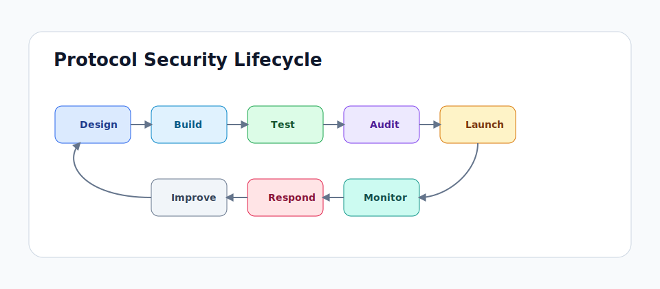
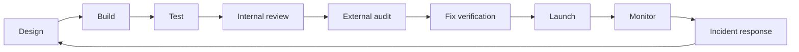

# Web3 Security Resources 2026

This guide is a curated, opinionated map for Web3 security work in 2026,
maintained by **Raiders0786 / DigiBastion**. It is designed for beginners,
smart contract auditors, protocol engineers, frontend security teams, incident
responders, compliance/investigations teams, and researchers working across EVM,
Solana, Move, Cairo/Starknet, and ZK systems.

## Choose Your Track

| Track | Use it when |
| --- | --- |
| [Start From Zero](roadmaps/start-from-zero.md) | You need blockchain, Solidity, tools, and security mindset from first principles. |
| [Solidity/EVM Auditor](roadmaps/solidity-evm-auditor.md) | You want to review Solidity systems, DeFi protocols, upgradeable contracts, and contest scopes. |
| [Rust/Solana Auditor](roadmaps/solana-rust-auditor.md) | You review Solana programs, Anchor projects, Token-2022 integrations, and CPI/account-model risks. |
| [Move Auditor](roadmaps/move-auditor.md) | You work on Aptos, Sui, Move resources, capabilities, and upgrade safety. |
| [Cairo/Starknet Auditor](roadmaps/cairo-starknet-auditor.md) | You audit Cairo contracts, Starknet account abstraction, messaging, and bridge flows. |
| [ZK Security](roadmaps/zk-security.md) | You review circuits, proof systems, constraint systems, and verifier integrations. |
| [Protocol Security Engineer](roadmaps/protocol-security-engineer.md) | You own security from design through monitoring and incident response. |
| [Full-Stack Web3 Security](roadmaps/full-stack-web3-security.md) | You secure DNS, web apps, wallets, APIs, package supply chain, and transaction UX. |
| [AI-Assisted Auditor](roadmaps/ai-assisted-auditor.md) | You want practical LLM workflows without outsourcing judgment to the model. |

## Core Coverage

| Area | Start here |
| --- | --- |
| Static, dynamic, fuzzing, symbolic, formal, and AI analysis | [Analysis Methods](resources/analysis-methods.md) |
| Frontend, API, DNS, cloud, CI/CD, and wallet UX security | [Offchain Security](resources/offchain-security.md) |
| Blockchain intelligence, investigations, compliance, and sanctions/AML context | [Compliance & Investigations](resources/compliance-and-investigations.md) |
| Monitoring, incident response, and emergency operations | [SOC & Monitoring](resources/soc-monitoring.md), [Incident Response](resources/incident-response.md) |

## The Operating Model

## Curated Resource Tiers

| Tier | Meaning |
| --- | --- |
| Must learn | Foundational resources worth reading carefully and revisiting. |
| Use in real audits | Tools, standards, and references that help during live review work. |
| Situational / advanced | Specialized material for bridges, ZK, governance, infra, or chain-specific risks. |
| Paid / certification | Useful structured training or products with a cost or restricted access model. |
| Watchlist | Promising or rapidly changing resources that should be verified before critical use. |

## High-Signal First Links

- [OWASP Smart Contract Top 10 2026](https://owasp.org/www-project-smart-contract-top-10/) for shared risk language.
- [OWASP Smart Contract Security Verification Standard](https://scs.owasp.org/SCSVS/) for assessment structure.
- [OpenZeppelin Audit Readiness](https://www.openzeppelin.com/readiness-guide) for preparing a codebase and team for review.
- [Solodit](https://solodit.cyfrin.io/) for searching public findings and contests.
- [SEAL Frameworks](https://frameworks.securityalliance.org/) for security operations and incident readiness.
- [DeFiHackLabs](https://github.com/SunWeb3Sec/DeFiHackLabs) for exploit reproduction and incident study.
- [Pashov AI Web3 Security](https://github.com/pashov/ai-web3-security) for tracking AI audit tools and skills.
- [TestMachine EVMbench](https://testmachine.ai/evmbench/) for AI EVM benchmark context and caveats.
- [DigiBastion Threat Intel](https://www.digibastion.com/threat-intel) for Web3, DeFi, supply-chain, and operational-security alerts.
- [VANTAGE by DigiBastion](https://vantage.digibastion.com/) for external domain, DNS, frontend, phishing, and Web3 trust-risk monitoring.

## How to Use This Site

Start with one roadmap, build the matching toolchain, then use the checklists on
real or toy systems. Do not try to consume every link. Good Web3 security work is
iterative: learn a class of bug, reproduce it, write tests for it, review real
reports, and then apply it to a scope with a clear threat model.

## Maintainer

- X: [@__Raiders](https://x.com/__Raiders)
- Telegram: [t.me/raiders0786](https://t.me/raiders0786)
- DigiBastion: [digibastion.com](https://digibastion.com/)
- Threat Intel alerts: [daily, weekly, or immediate subscriptions](https://www.digibastion.com/threat-intel?tab=subscribe)
- VANTAGE: [vantage.digibastion.com](https://vantage.digibastion.com/)
