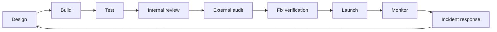

<section class="w3s-hero" markdown>
# Web3 Security Resources 2026

Curated Web3 security learning hub by **[Raiders0786](https://x.com/__Raiders) / [DigiBastion](https://www.digibastion.com)** for smart
contract auditors, protocol teams, engineers, founders, incident responders, and
researchers working across EVM, Solana, Move, Cairo/Starknet, ZK, frontends,
infrastructure, investigations, and protocol operations.

[Choose your path](personas/index.md){ .w3s-button .w3s-button-primary }
[Start with roadmaps](#choose-your-track){ .w3s-button .w3s-button-primary }
[Browse tools](resources/analysis-methods.md){ .w3s-button }
[Threat intel alerts](https://www.digibastion.com/threat-intel?tab=subscribe){ .w3s-button }
[VANTAGE](https://vantage.digibastion.com/){ .w3s-button }

</section>

## I am...

[**An aspiring auditor**Follow a 30/60/90-day path through exploit reproduction, invariants, reports, and testing.](personas/aspiring-auditors.md){ .w3s-card }
[**A protocol founder**Prepare launch gates, audit evidence, multisig operations, monitoring, and incident readiness.](personas/protocol-founders.md){ .w3s-card }
[**A security lead**Run control ownership, monitoring, bounty intake, tabletop drills, and executive evidence.](personas/protocol-security-leads.md){ .w3s-card }
[**A frontend or wallet engineer**Protect signing paths, browser-shipped code, wallet UX, account abstraction, and supply chains.](personas/frontend-wallet-engineers.md){ .w3s-card }
[**An incident responder**Prepare containment, evidence preservation, transaction simulation, signer safety, and public comms.](personas/incident-responders.md){ .w3s-card }
[**In compliance or investigations**Connect reports, wallet activity, domain evidence, escalation paths, and careful case records.](personas/compliance-investigations.md){ .w3s-card }

## Choose your track

[**Start from zero**Learn blockchain, Solidity, tools, and the security mindset from first principles.](roadmaps/start-from-zero.md){ .w3s-card }
[**Solidity/EVM auditor**Review DeFi, upgradeable contracts, accounting, oracles, and contest scopes.](roadmaps/solidity-evm-auditor.md){ .w3s-card }
[**AI-era smart contract auditor**Build the durable skills AI cannot replace: exploit reasoning, invariants, and proof.](roadmaps/ai-era-smart-contract-auditor.md){ .w3s-card }
[**Rust/Solana auditor**Review account models, Anchor programs, Token-2022, PDAs, signers, and CPI flows.](roadmaps/solana-rust-auditor.md){ .w3s-card }
[**Move auditor**Review resources, capabilities, object ownership, and upgrade paths across Move systems.](roadmaps/move-auditor.md){ .w3s-card }
[**Cairo/Starknet auditor**Review Cairo contracts, account abstraction, messaging, and bridge assumptions.](roadmaps/cairo-starknet-auditor.md){ .w3s-card }
[**ZK security**Study circuits, constraints, trusted setup, verifier integrations, and proof systems.](roadmaps/zk-security.md){ .w3s-card }
[**Protocol security engineer**Own threat models, launch readiness, monitoring, incident response, and governance.](roadmaps/protocol-security-engineer.md){ .w3s-card }
[**Full-stack Web3 security**Secure DNS, frontends, wallets, APIs, CI/CD, dependencies, and offchain controls.](roadmaps/full-stack-web3-security.md){ .w3s-card }
[**AI-assisted auditor**Use LLMs for reading and scaffolding while verifying every security claim yourself.](roadmaps/ai-assisted-auditor.md){ .w3s-card }

## Roadmap for the AI era

Short answer: yes, smart contract auditing is still worth learning. AI will make
surface-level review cheaper, but it raises the bar for humans. The durable path
is to reproduce real exploits, write invariants, verify AI output, study real
reports, and build public proof that you can reason from code to impact.

[Read the AI-era smart contract auditor roadmap](roadmaps/ai-era-smart-contract-auditor.md){ .w3s-button .w3s-button-primary }

## Core coverage

[**Reproduce exploits**Turn public incidents into local tests, traces, and clear root-cause notes.](resources/reports-and-vuln-intel.md){ .w3s-card }
[**Write invariants**Use fuzzing and property tests to prove what must never break in protocol state.](resources/analysis-methods.md){ .w3s-card }
[**Verify AI output**Treat LLM output as hypotheses until code, tests, traces, or formal reasoning confirm it.](roadmaps/ai-assisted-auditor.md){ .w3s-card }
[**Study real reports**Read high-quality findings for exploit path, impact, severity, and fix reasoning.](resources/reports-and-vuln-intel.md){ .w3s-card }

## Maintainer projects

Free alerts

**[DigiBastion Threat Intel](https://www.digibastion.com/threat-intel)** tracks
Web3, DeFi, supply-chain, OPSEC, personal-protection, vulnerability-disclosure,
and tool-review updates. Founders, developers, and security engineers can
subscribe to [daily, weekly, or immediate email alerts](https://www.digibastion.com/threat-intel?tab=subscribe).

External trust

**[VANTAGE by DigiBastion](https://vantage.digibastion.com/)** monitors external
domain, DNS, frontend, phishing, and Web3 trust risk for teams that need
evidence-backed remediation and recurring drift visibility.

## The operating model

## Curated resource tiers

| Tier | Meaning |
| --- | --- |
| Must learn | Foundational resources worth reading carefully and revisiting. |
| Use in real audits | Tools, standards, and references that help during live review work. |
| Situational / advanced | Specialized material for bridges, ZK, governance, infra, or chain-specific risks. |
| Paid / certification | Useful structured training or products with a cost or restricted access model. |
| Watchlist | Promising or rapidly changing resources that should be verified before critical use. |

## High-signal first links

- [OWASP Smart Contract Top 10 2026](https://owasp.org/www-project-smart-contract-top-10/) for shared risk language.
- [OWASP Smart Contract Security Verification Standard](https://scs.owasp.org/SCSVS/) for assessment structure.
- [OpenZeppelin Audit Readiness](https://www.openzeppelin.com/readiness-guide) for preparing a codebase and team for review.
- [Solodit](https://solodit.cyfrin.io/) for searching public findings and contests.
- [SEAL Frameworks](https://frameworks.securityalliance.org/) for security operations and incident readiness.
- [DeFiHackLabs](https://github.com/SunWeb3Sec/DeFiHackLabs) for exploit reproduction and incident study.
- [Pashov AI Web3 Security](https://github.com/pashov/ai-web3-security) for tracking AI audit tools and skills.
- [TestMachine EVMbench](https://testmachine.ai/evmbench/) for AI EVM benchmark context and caveats, not as a replacement for review.
- [DigiBastion Threat Intel](https://www.digibastion.com/threat-intel) for Web3, DeFi, supply-chain, and operational-security alerts.
- [VANTAGE by DigiBastion](https://vantage.digibastion.com/) for external domain, DNS, frontend, phishing, and Web3 trust-risk monitoring.

## How to use this site

Start with one roadmap, build the matching toolchain, then use the checklists on
real or toy systems. Do not try to consume every link. Good Web3 security work is
iterative: learn a class of bug, reproduce it, write tests for it, review real
reports, and then apply it to a scope with a clear threat model.

## Maintainer

- X: [@__Raiders](https://x.com/__Raiders)
- Telegram: [t.me/raiders0786](https://t.me/raiders0786)
- DigiBastion: [digibastion.com](https://digibastion.com/)
- Threat Intel alerts: [daily, weekly, or immediate subscriptions](https://www.digibastion.com/threat-intel?tab=subscribe)
- VANTAGE: [vantage.digibastion.com](https://vantage.digibastion.com/)
