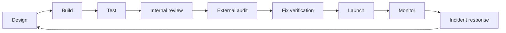

<section class="w3s-hero" markdown>
# Web3 Security Resources 2026

Curated Web3 security hub by **Raiders0786 / DigiBastion** for auditors,
engineers, founders, incident responders, and researchers working across EVM,
Solana, Move, Cairo/Starknet, ZK, frontends, infrastructure, investigations, and
protocol operations.

[Start with roadmaps](#choose-your-track){ .w3s-button .w3s-button-primary }
[Browse tools](resources/analysis-methods.md){ .w3s-button }
[Threat intel alerts](https://www.digibastion.com/threat-intel?tab=subscribe){ .w3s-button }
[VANTAGE](https://vantage.digibastion.com/){ .w3s-button }

</section>

## Choose Your Track

[**Start From Zero**Blockchain, Solidity, tools, and security mindset from first principles.](roadmaps/start-from-zero.md){ .w3s-card }
[**Solidity/EVM Auditor**Review DeFi, upgradeable contracts, accounting, oracles, and contest scopes.](roadmaps/solidity-evm-auditor.md){ .w3s-card }
[**Rust/Solana Auditor**Account model, Anchor, Token-2022, PDAs, signers, and CPI risks.](roadmaps/solana-rust-auditor.md){ .w3s-card }
[**Move Auditor**Aptos, Sui, resources, capabilities, object ownership, and upgrades.](roadmaps/move-auditor.md){ .w3s-card }
[**Cairo/Starknet Auditor**Cairo contracts, account abstraction, messaging, and bridge assumptions.](roadmaps/cairo-starknet-auditor.md){ .w3s-card }
[**ZK Security**Circuits, constraints, trusted setup, verifier integrations, and proof systems.](roadmaps/zk-security.md){ .w3s-card }
[**Protocol Security Engineer**Threat modeling, launch readiness, monitoring, incident response, and governance.](roadmaps/protocol-security-engineer.md){ .w3s-card }
[**Full-Stack Web3 Security**DNS, frontends, wallets, APIs, CI/CD, supply chain, and offchain controls.](roadmaps/full-stack-web3-security.md){ .w3s-card }
[**AI-Assisted Auditor**Practical LLM workflows with verification-first guardrails.](roadmaps/ai-assisted-auditor.md){ .w3s-card }

## Core Coverage

[**Analysis Methods**Static analysis, dynamic review, fuzzing, symbolic execution, formal methods, and AI.](resources/analysis-methods.md){ .w3s-card }
[**Offchain Security**Frontend, API, DNS, cloud, CI/CD, package, wallet UX, and support-surface security.](resources/offchain-security.md){ .w3s-card }
[**Compliance & Investigations**Blockchain intelligence, sanctions/AML context, investigations, and fund tracing.](resources/compliance-and-investigations.md){ .w3s-card }
[**SOC & Monitoring**Detection, alerting, protocol operations, emergency actions, and drift monitoring.](resources/soc-monitoring.md){ .w3s-card }

## Maintainer Projects

Free alerts

**[DigiBastion Threat Intel](https://www.digibastion.com/threat-intel)** tracks
Web3, DeFi, supply-chain, OPSEC, personal-protection, vulnerability-disclosure,
and tool-review updates. Founders, developers, and security engineers can
subscribe to [daily, weekly, or immediate email alerts](https://www.digibastion.com/threat-intel?tab=subscribe).

External trust

**[VANTAGE by DigiBastion](https://vantage.digibastion.com/)** monitors external
domain, DNS, frontend, phishing, and Web3 trust risk for teams that need
evidence-backed remediation and recurring drift visibility.

## The Operating Model

## Curated Resource Tiers

| Tier | Meaning |
| --- | --- |
| Must learn | Foundational resources worth reading carefully and revisiting. |
| Use in real audits | Tools, standards, and references that help during live review work. |
| Situational / advanced | Specialized material for bridges, ZK, governance, infra, or chain-specific risks. |
| Paid / certification | Useful structured training or products with a cost or restricted access model. |
| Watchlist | Promising or rapidly changing resources that should be verified before critical use. |

## High-Signal First Links

- [OWASP Smart Contract Top 10 2026](https://owasp.org/www-project-smart-contract-top-10/) for shared risk language.
- [OWASP Smart Contract Security Verification Standard](https://scs.owasp.org/SCSVS/) for assessment structure.
- [OpenZeppelin Audit Readiness](https://www.openzeppelin.com/readiness-guide) for preparing a codebase and team for review.
- [Solodit](https://solodit.cyfrin.io/) for searching public findings and contests.
- [SEAL Frameworks](https://frameworks.securityalliance.org/) for security operations and incident readiness.
- [DeFiHackLabs](https://github.com/SunWeb3Sec/DeFiHackLabs) for exploit reproduction and incident study.
- [Pashov AI Web3 Security](https://github.com/pashov/ai-web3-security) for tracking AI audit tools and skills.
- [TestMachine EVMbench](https://testmachine.ai/evmbench/) for AI EVM benchmark context and caveats, not as a replacement for review.
- [DigiBastion Threat Intel](https://www.digibastion.com/threat-intel) for Web3, DeFi, supply-chain, and operational-security alerts.
- [VANTAGE by DigiBastion](https://vantage.digibastion.com/) for external domain, DNS, frontend, phishing, and Web3 trust-risk monitoring.

## How to Use This Site

Start with one roadmap, build the matching toolchain, then use the checklists on
real or toy systems. Do not try to consume every link. Good Web3 security work is
iterative: learn a class of bug, reproduce it, write tests for it, review real
reports, and then apply it to a scope with a clear threat model.

## Maintainer

- X: [@__Raiders](https://x.com/__Raiders)
- Telegram: [t.me/raiders0786](https://t.me/raiders0786)
- DigiBastion: [digibastion.com](https://digibastion.com/)
- Threat Intel alerts: [daily, weekly, or immediate subscriptions](https://www.digibastion.com/threat-intel?tab=subscribe)
- VANTAGE: [vantage.digibastion.com](https://vantage.digibastion.com/)
