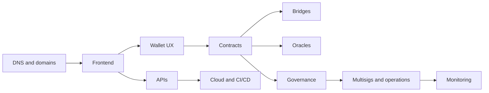

# Full-Stack Web3 Security

Audience: Web3 app security teams, frontend engineers, protocol security leads,
wallet teams, and incident responders.

Smart contract security is only one layer. Many losses start in DNS, frontends,
wallet-drainer UX, build pipelines, package compromise, analytics scripts,
admin panels, and monitoring gaps.

## Attack Surface

## Must Learn

| Resource | Why |
| --- | --- |
| [OWASP Web Security Testing Guide](https://owasp.org/www-project-web-security-testing-guide/) | Baseline web app testing methodology. |
| [OWASP ASVS](https://owasp.org/www-project-application-security-verification-standard/) | Application control standard for APIs and frontends. |
| [OWASP SC Top 10: Web3 Attack Vectors](https://scs.owasp.org/sctop10/Web3-Attack-Vectors-Top15/) | Web3 risks beyond contracts. |
| [Socket](https://socket.dev/) | JavaScript dependency and install-time risk visibility. |
| [OpenSSF Scorecard](https://github.com/ossf/scorecard) | Open-source supply-chain health checks. |
| [DigiBastion](https://digibastion.com/) | Maintainer-labeled resource for DNS, domain, and OPSEC security. |
| [VANTAGE](https://vantage.security/) | Maintainer-labeled protocol intelligence and risk analytics resource. |

## Review Areas

- Domain registrar, DNSSEC, nameserver, email, CDN, and TLS posture.
- Frontend build provenance, hosting, CSP, dependency pinning, and third-party scripts.
- Wallet transaction simulation, spender approvals, typed data, chain IDs, and phishing resistance.
- API authentication, authorization, rate limiting, and tenant isolation.
- CI/CD secrets, deploy permissions, branch protection, and artifact integrity.
- Monitoring for domain takeover, frontend drift, contract events, admin actions, and anomalous flows.

## Deliverable

Produce a full-stack security map that links every user asset to the systems that
can change it: contracts, frontends, APIs, admin panels, cloud accounts, DNS,
CI/CD, governance, multisigs, and external services.
