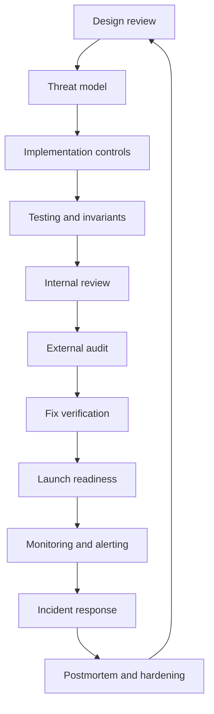

# Protocol Security Engineer

Audience: security leads, protocol engineers, governance contributors, and
operators responsible for keeping a live protocol safe.

## Outcomes

- Run security from design through launch, monitoring, incident response, and postmortems.
- Build threat models, audit plans, bug bounties, monitoring rules, and emergency procedures.
- Coordinate engineering, governance, legal, comms, and external responders during incidents.

## Lifecycle

## Must Learn

| Resource | Why |
| --- | --- |
| [SEAL Frameworks](https://frameworks.securityalliance.org/) | Practical security operations and incident readiness frameworks for crypto teams. |
| [SEAL 911](https://securityalliance.org/seal-911) | Emergency response coordination path for severe crypto incidents. |
| [OpenZeppelin Readiness Guide](https://www.openzeppelin.com/readiness-guide) | Audit and launch preparation model for teams. |
| [Immunefi](https://immunefi.com/) | Bug bounty operations and vulnerability disclosure norms. |
| [OWASP SCSVS](https://scs.owasp.org/SCSVS/) | Verification standard for smart contract controls. |

## Operating Cadence

| Cadence | Activity |
| --- | --- |
| Per design | Threat model, privilege inventory, invariants, abuse cases. |
| Per PR | Security-sensitive code review and test updates. |
| Pre-audit | Freeze scope, document assumptions, run tools, prepare deployment docs. |
| Pre-launch | Verify roles, multisigs, monitoring, runbooks, and rollback paths. |
| Weekly | Review alerts, dependencies, admin actions, governance proposals, and incidents. |
| Quarterly | Rehearse incident response and rotate stale access. |

## Use in Real Work

- Keep a living asset and privilege inventory.
- Require explicit risk acceptance for known issues before launch.
- Monitor contracts, admin actions, frontends, DNS, bridges, oracles, and governance.
- Prepare public and private incident communications before they are needed.
- Treat audit reports as inputs to a broader security program, not a launch certificate.
